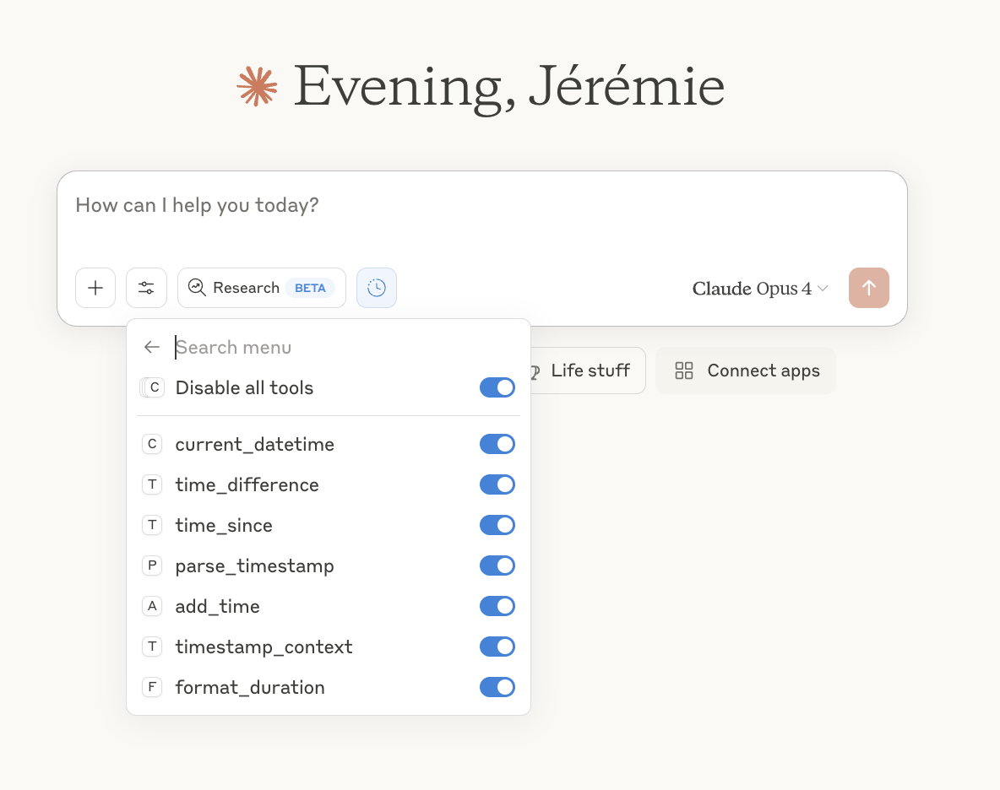

# Passage of Time MCP

An MCP server that gives language models temporal awareness and time calculation abilities.
Teaching LLMs the significance of the passage of time through collaborative tool development.



## Supported Tools

- [x] Current date/time with timezone (`current_datetime`)
- [x] Duration between two timestamps (`time_difference`)
- [x] Human context for a timestamp (`timestamp_context`)
- [x] Elapsed time since a timestamp (`time_since`)
- [x] Parse and convert timestamp formats (`parse_timestamp`)
- [x] Add or subtract time (`add_time`)
- [x] Format duration in multiple styles (`format_duration`)

For response formats and detailed usage, see [docs/guide-tool-reference.md](docs/guide-tool-reference.md).

## Prerequisites

- Python 3.12+
- [uv](https://docs.astral.sh/uv/) (recommended) or pip
- An MCP-compatible client (Claude.ai, Continue.dev, etc.)

## Quick Start

1. Clone this repository locally.

    ```bash
    git clone [REPOSITORY_URL]
    cd passage-of-time-mcp
    ```

1. Install dependencies.

    ```bash
    uv sync
    ```

1. Run the server.

    ```bash
    uv run passage-of-time-mcp
    ```

The server starts on `http://0.0.0.0:8000/mcp` using the Streamable HTTP transport.

## Connect with Clients

| Client | Transport | Guide |
|--------|-----------|-------|
| Claude (web) | HTTP | [docs/setup-cloudflare.md](docs/setup-cloudflare.md) |

## About

This project was originally created by [Jeremie Lumbroso](https://github.com/jlumbroso) and Claude through human-LLM collaboration — equipping language models with a calculator for time. This fork adapts the server for self-hosted deployment on Claude.ai via Cloudflare Tunnel, with the default timezone changed to `Asia/Seoul`.

For the full origin story, acknowledgments, and references, see [docs/guide-about.md](docs/guide-about.md). Licensed under [MPL-2.0](LICENSE).
